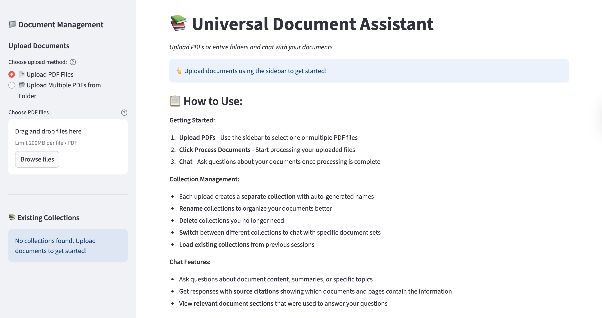
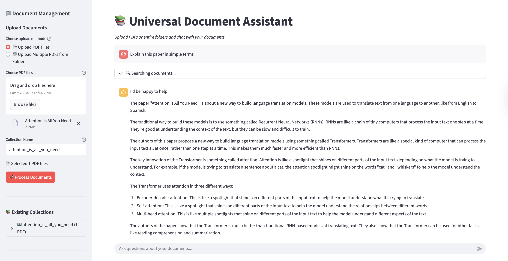

# ChatDOC - PDF Document Assistant

A powerful AI-powered document processing and search system that transforms PDF documents into an intelligent, searchable knowledge base. ChatDOC combines vector embeddings with LLM chat interface for seamless document interaction.

## 🌟 Features

- **Smart PDF Processing**: Fast text extraction using PyMuPDF with heading detection
- **Vector Search**: Semantic search using HuggingFace embeddings and ChromaDB
- **AI Chat Interface**: Interactive Q&A with your documents using Groq LLM
- **Collection Management**: Organize documents into named collections with rename/delete
- **Multiple Interfaces**: Web UI (Streamlit) and command-line tools
- **Batch Processing**: Handle multiple PDFs and entire folders
- **Smart Chunking**: Intelligent text splitting with configurable parameters

## 📸 Screenshots

### ChatDOC Interface


_Clean, intuitive ChatDOC interface for uploading PDFs and managing document collections_

### AI Chat with Documents


_Interactive ChatDOC interface with real-time document search and AI-powered responses_

## 🚀 Quick Start

### Prerequisites

```bash
pip install streamlit chromadb langchain-huggingface langchain-chroma langchain-groq
pip install PyMuPDF pandas python-dotenv
```

### Environment Setup

Create a `.env` file:

```env
GROQ_API_KEY=your_groq_api_key_here
```

### 1. Web Interface (Recommended)

```bash
streamlit run enhanced_chat_app.py
```

**Using the ChatDOC Interface:**

- **📄 Upload PDFs**: Select single or multiple PDF files via the sidebar upload area
- **🚀 Process Documents**: Click the "Process Documents" button to convert PDFs into searchable format
- **💬 Chat Interface**: Ask questions about your documents once processing is complete
- **📚 Collection Management**: Each upload creates a separate, organized collection of documents
- **🔄 Load Collections**: Switch between different document collections to chat with specific sets
- **✏️ Rename Collections**: Customize collection names for better organization
- **🗑️ Delete Collections**: Remove collections you no longer need
- **📊 Collection Stats**: View document count and metadata for each collection
- **🔍 Source Citations**: Get responses with exact document and page references
- **📖 Document Sections**: View the specific text sections used to answer your questions

### 2. Batch Processing

```bash
# Process default folder
python enhanced_pdf_processor.py

# Process specific folder
python enhanced_pdf_processor.py -i /path/to/pdfs -c my_collection

# Multiple folders with custom settings
python enhanced_pdf_processor.py -i folder1 folder2 -c research --recursive --max-tokens 1500
```

### 3. Command-Line Search

```bash
# List collections
python enhanced_search_interface.py --list

# Search specific collection
python enhanced_search_interface.py -c documents -q "machine learning"

# Interactive chat mode
python enhanced_search_interface.py -c research --chat
```

## 📁 Project Structure

- `enhanced_chat_app.py` - ChatDOC Streamlit web interface
- `enhanced_pdf_processor.py` - Batch PDF processing
- `enhanced_search_interface.py` - Command-line search tool
- `data/chroma_db/` - Vector database storage

## ⚙️ Configuration

### Processing Options

- **Chunk Size**: Default 1000 tokens (configurable)
- **Overlap**: Default 200 tokens for context continuity
- **Embedding Model**: `all-MiniLM-L6-v2` (fast, efficient)
- **LLM**: Groq Llama3-8B (requires API key)

### Smart Features

- **Auto-naming**: Collections named based on content
- **Heading Detection**: Extracts document structure
- **Page Tracking**: Maintains source page references
- **Metadata Preservation**: Full document context retained

## 🎯 Use Cases

- **Research**: Analyze academic papers and reports
- **Documentation**: Search technical manuals and guides
- **Legal**: Process contracts and legal documents
- **Business**: Analyze reports, proposals, and presentations
- **Education**: Study materials and reference documents

## 📊 Performance

- **Fast Processing**: PyMuPDF for efficient PDF parsing
- **Smart Chunking**: Preserves document context and readability
- **Accurate Search**: Semantic similarity with source citations
- **Scalable**: Handles large document collections efficiently

## 🛠️ Command Examples

```bash
# Basic processing
python enhanced_pdf_processor.py

# Advanced processing
python enhanced_pdf_processor.py \
  -i research_papers reports \
  -c academic_collection \
  --recursive \
  --max-tokens 1500 \
  --smart-naming

# Collection management
python enhanced_search_interface.py --list
python enhanced_search_interface.py --delete old_collection

# Advanced search
python enhanced_search_interface.py \
  -c documents \
  -q "neural networks" \
  --chat \
  --show-metadata
```

## 🔧 Dependencies

- **streamlit** - Web interface
- **chromadb** - Vector database
- **PyMuPDF (fitz)** - PDF processing
- **langchain** - LLM framework
- **sentence-transformers** - Embeddings
- **python-dotenv** - Environment management

## 📝 License

MIT License - see LICENSE file for details

## 🤝 Contributing

Contributions welcome! Please read the contributing guidelines and submit pull requests for any improvements.

---

**Get started in minutes**: Upload PDFs → Ask questions → Get intelligent answers with source citations! 🎉

_ChatDOC - Your intelligent PDF companion_ 📚✨
